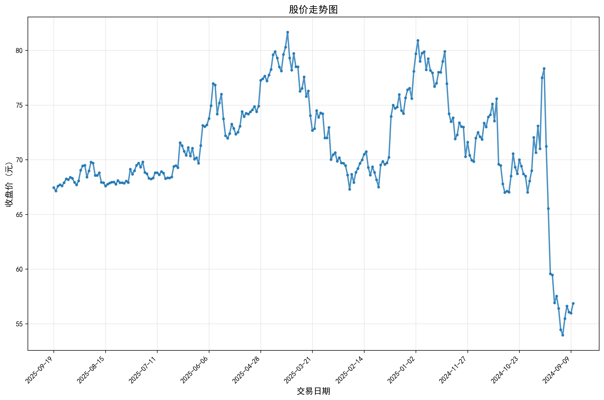

# 🚀 A股金融年报ChatBI系统 - 智能股票数据分析平台

<div align="center">

[](https://www.python.org/downloads/)
[](https://github.com/QwenLM/Qwen-Agent)
[](https://gradio.app/)
[](https://opensource.org/licenses/MIT)
[](https://github.com/your-username/stock-chatbi)

**🌟 基于大模型的A股智能分析平台 🌟**

*将复杂的股票数据分析转换为直观的对话交互，让投资决策变得像聊天一样简单*

[🎯 快速开始](#-快速开始) • [✨ 核心特性](#-核心特性) • [🏗️ 系统架构](#️-系统架构) • [📖 使用指南](#-使用指南) • [🔧 API文档](#-api文档)

</div>

---

## 🎯 项目概要

**A股金融年报ChatBI系统** 是一个基于qwen-agent框架开发的智能股票数据分析平台，它打破了传统金融分析的技术壁垒。通过先进的大语言模型和多种机器学习算法，让任何人都能用自然语言轻松分析A股数据，无需学习复杂的金融分析工具。

本系统集成了SQL查询、数据可视化、热点新闻搜索、ARIMA价格预测、布林带异常检测和Prophet周期性分析等功能，为用户提供全方位的股票数据分析和投资决策支持。

### 📸 效果展示

#### 🔍 智能对话分析

<div align="center">


*自然语言交互，智能理解用户查询意图*

</div>

#### 📊 多维度数据可视化

<div align="center">



*支持多股票对比分析，直观展示数据关系*

</div>

#### 🎯 ARIMA预测分析

<div align="center">


*基于ARIMA模型的股价预测，提供投资参考*

</div>

#### 🔍 布林带异常检测

<div align="center">


*布林带技术指标分析，识别超买超卖点*

</div>

#### 📊 Prophet周期性分析

<div align="center">


*Prophet模型分析股票周期性和趋势规律*

</div>

### 🌈 为什么选择 A股金融年报ChatBI系统？

- 🧠 **AI驱动**: 基于qwen-agent框架，理解复杂的金融查询
- ⚡ **实时数据**: 连接阿里云MySQL，获取最新A股数据
- 🔄 **智能分析**: 集成多种机器学习算法，提供专业分析
- 🌐 **Web界面**: 基于Gradio的现代化用户界面
- 🛡️ **企业级**: 支持多种分析工具，保障分析准确性
- 📊 **零门槛**: 自然语言交互，无需技术背景

---

## ✨ 核心特性

### 🎨 智能化特性

| 特性 | 描述 | 技术亮点 |
|------|------|----------|
| 🧠 **智能SQL生成** | 自动将自然语言转换为SQL查询 | 基于qwen-agent的语义理解 |
| 🔍 **多维度分析** | 支持价格、涨跌幅、成交量等多维度分析 | 智能数据关联和统计 |
| 🗣️ **自然语言查询** | 支持复杂的中文金融查询 | 多模型支持(Qwen/GLM/OpenAI) |
| 🔄 **智能可视化** | 自动选择最佳图表类型和展示方式 | 数据驱动 + 智能优化 |
| 📊 **结构化输出** | Markdown格式的标准化分析结果 | 专业金融报告格式 |

### ⚡ 分析功能特性

| 功能模块 | 描述 | 技术实现 |
|----------|------|----------|
| 🚀 **SQL查询分析** | 灵活的数据库查询和统计 | SQLAlchemy + Pandas |
| ⚡ **ARIMA预测** | 基于时间序列的股价预测 | Statsmodels + ARIMA模型 |
| 🔄 **布林带检测** | 超买超卖异常点识别 | 技术指标计算 + 可视化 |
| 📈 **Prophet分析** | 周期性规律和趋势分析 | Facebook Prophet |
| 🌐 **新闻搜索** | 实时财经新闻获取 | Tavily API集成 |

### 🛠️ 技术特性

- **🔧 模块化设计**: 每个功能独立模块，易于维护和扩展
- **🧠 智能缓存**: 图表生成缓存，提升响应速度
- **📦 多数据源**: 支持MySQL、CSV等多种数据源
- **🔄 实时更新**: 支持增量数据更新和实时分析
- **⚡ 异步处理**: 多任务并发处理，提升系统性能
- **🛡️ 错误恢复**: 完善的异常处理和自动恢复机制

### 🔧 核心技术展示

#### 🧠 AI大模型技术栈

<div align="center">

```
┌─────────────────────────────────────────────────────────────┐
│                    🤖 大模型层                                │
│  Qwen-Agent + DashScope + 自然语言理解                      │
├─────────────────────────────────────────────────────────────┤
│                    📊 数据分析层                             │
│  ARIMA + Prophet + 布林带 + 技术指标计算                     │
├─────────────────────────────────────────────────────────────┤
│                    💾 数据处理层                             │
│  SQLAlchemy + Pandas + Matplotlib + 数据清洗                │
├─────────────────────────────────────────────────────────────┤
│                    🌐 服务层                                │
│  Gradio WebUI + 异步处理 + 实时交互                         │
└─────────────────────────────────────────────────────────────┘
```

</div>

#### 📈 机器学习算法集成

| 算法 | 技术实现 | 应用场景 | 效果展示 |
|------|----------|----------|----------|
| **ARIMA时间序列** | Statsmodels + 自回归模型 | 股价预测 |  |
| **Prophet周期性** | Facebook Prophet | 趋势分析 |  |
| **布林带技术指标** | 移动平均 + 标准差 | 异常检测 |  |
| **SQL智能查询** | 自然语言转SQL | 数据检索 |  |

#### 🌐 系统架构技术

<div align="center">


*基于qwen-agent的智能分析平台架构*

</div>

---

## 🏗️ 系统架构

### 📋 核心工作流


### 🏛️ 技术架构

<div align="center">

```
┌─────────────────────────────────────────────────────────────┐
│                    🌐 Web界面层                              │
│  Gradio WebUI + 实时交互 + 图表展示                          │
├─────────────────────────────────────────────────────────────┤
│                    🧠 AI推理层                               │
│  qwen-agent框架 + 多工具集成 + 智能路由                      │
├─────────────────────────────────────────────────────────────┤
│                    🔍 分析引擎层                             │
│  ARIMA预测 + 布林带检测 + Prophet分析 + 技术指标             │
├─────────────────────────────────────────────────────────────┤
│                    💾 数据处理层                             │
│  SQLAlchemy + Pandas + Matplotlib + 数据清洗                │
├─────────────────────────────────────────────────────────────┤
│                    📊 数据源层                               │
│  阿里云MySQL + A股数据 + 实时更新                           │
└─────────────────────────────────────────────────────────────┘
```

</div>

### 🔧 核心组件

| 组件 | 功能 | 技术栈 |
|------|------|--------|
| **🎯 ExcSQLTool** | SQL查询和数据可视化 | SQLAlchemy + Matplotlib |
| **📈 ARIMAStockTool** | ARIMA股价预测 | Statsmodels + 时间序列分析 |
| **🔍 BollDetectionTool** | 布林带异常检测 | 技术指标计算 + 可视化 |
| **📊 ProphetAnalysisTool** | 周期性分析 | Facebook Prophet |
| **🌐 NewsSearchTool** | 热点新闻搜索 | Tavily API |
| **⚡ 图表生成引擎** | 智能图表生成 | Matplotlib + 数据驱动 |

---

## 🎯 核心模块演示

### 📊 1. SQL查询与数据可视化模块

#### 🔍 功能特点
- **智能SQL生成**: 自然语言自动转换为SQL查询
- **多维度分析**: 支持价格、涨跌幅、成交量等分析
- **智能图表**: 根据数据特征自动选择最佳图表类型

#### 📈 演示效果

<div align="center">


*多股票对比分析，直观展示数据关系*

</div>

#### 🛠️ 技术实现
```python
# 核心技术栈
- SQLAlchemy: 数据库ORM操作
- Pandas: 数据处理和分析
- Matplotlib: 图表生成和可视化
- 智能图表选择算法
```

### 📈 2. ARIMA股价预测模块

#### 🔍 功能特点
- **时间序列分析**: 基于历史数据预测未来走势
- **多模型支持**: ARIMA(1,1,1)到ARIMA(5,1,5)自适应选择
- **预测可视化**: 历史数据与预测结果对比展示

#### 📈 演示效果

<div align="center">


*基于ARIMA模型的股价预测，提供投资参考*

</div>

#### 🛠️ 技术实现
```python
# 核心技术栈
- Statsmodels: ARIMA模型实现
- 时间序列平稳性检验
- 自动参数优化算法
- 预测置信区间计算
```

### 🔍 3. 布林带异常检测模块

#### 🔍 功能特点
- **技术指标计算**: 20日移动平均线 + 2倍标准差
- **异常点识别**: 自动检测超买超卖信号
- **可视化分析**: 价格走势与布林带关系展示

#### 📈 演示效果

<div align="center">


*布林带技术指标分析，识别超买超卖点*

</div>

#### 🛠️ 技术实现
```python
# 核心技术栈
- 移动平均线计算
- 标准差统计分析
- 异常点检测算法
- 技术指标可视化
```

### 📊 4. Prophet周期性分析模块

#### 🔍 功能特点
- **趋势分析**: 识别长期趋势变化
- **周期性检测**: 周度和年度周期性规律
- **季节性分解**: 趋势、季节性、噪声分离

#### 📈 演示效果

<div align="center">


*Prophet模型分析股票周期性和趋势规律*

</div>

#### 🛠️ 技术实现
```python
# 核心技术栈
- Facebook Prophet: 时间序列预测
- 季节性分解算法
- 趋势变化点检测
- 周期性模式识别
```

### 🌐 5. 热点新闻搜索模块

#### 🔍 功能特点
- **实时新闻**: 获取最新财经热点
- **智能搜索**: 基于Tavily API的新闻检索
- **内容整合**: 新闻与股票数据关联分析

#### 📈 演示效果

<div align="center">


*实时财经新闻获取，提供市场热点信息*

</div>

#### 🛠️ 技术实现
```python
# 核心技术栈
- Tavily API: 新闻搜索服务
- 异步网络请求
- 内容过滤和排序
- 新闻摘要生成
```

---

## 🚀 快速开始

### 📋 环境要求

- 🐍 **Python**: 3.8+
- 💾 **内存**: 建议8GB+
- 🔧 **系统**: Windows/Linux/macOS
- 🌐 **网络**: 需要访问阿里云MySQL和Tavily API

### ⚡ 一键安装

```bash
# 1. 克隆项目
git clone https://github.com/your-username/stock-chatbi.git
cd stock-chatbi

# 2. 创建虚拟环境
python -m venv venv
# Windows
venv\Scripts\activate
# Linux/Mac
source venv/bin/activate

# 3. 安装依赖
pip install -r requirements.txt

# 4. 配置环境
cp .env.example .env
# 编辑 .env 文件，填入你的API密钥
```

### 🔑 环境配置

编辑 `.env` 文件：

```env
# 🤖 大模型配置
DASHSCOPE_API_KEY=your_dashscope_api_key_here

# 🌐 新闻搜索配置
TAVILY_API_KEY=your_tavily_api_key_here

# 💾 数据库配置
DB_HOST=your_mysql_host
DB_USER=your_mysql_user
DB_PASSWORD=your_mysql_password
DB_NAME=your_database_name
```

### 🎯 快速启动

```bash
# 🚀 启动系统
python main.py

# 系统将自动启动Web界面
# 🌐 访问地址: http://localhost:7860
```

---

## 📖 使用指南

### 🌐 Web界面模式（推荐）

#### 🚀 启动系统

```bash
# 启动完整系统
python main.py

# 系统信息
# 🌐 地址: http://localhost:7860
# 📡 协议: HTTP/WebSocket
# 🔧 状态: 自动健康检查
```

#### 🧪 功能测试

```bash
# 测试SQL查询功能
"查询青岛啤酒(sh.600600)最近一年的股价走势"

# 测试对比分析
"对比青岛啤酒(sh.600600)和方正科技(sh.600601)的涨跌幅"

# 测试预测功能
"预测青岛啤酒(sh.600600)未来5天的股价"

# 测试技术分析
"检测青岛啤酒(sh.600600)的布林带异常点"

# 测试周期性分析
"分析青岛啤酒(sh.600600)的周期性规律"
```

### 💻 API调用示例

#### Python客户端

```python
import requests
import json

def query_stock_data(query: str):
    response = requests.post(
        'http://localhost:7860/api/query',
        json={'query': query}
    )
    result = response.json()
    print(json.dumps(result, ensure_ascii=False, indent=2))

# 🎯 使用示例
query_stock_data("查询平安银行(sz.000001)的股价走势")
```

#### cURL命令

```bash
# 📊 查询股票数据
curl -X POST http://localhost:7860/api/query \
  -H "Content-Type: application/json" \
  -d '{"query": "查询青岛啤酒(sh.600600)的股价走势"}'

# 📈 获取预测分析
curl -X POST http://localhost:7860/api/query \
  -H "Content-Type: application/json" \
  -d '{"query": "预测青岛啤酒(sh.600600)未来5天的股价"}'
```

---

## 🔧 API文档

### 🛠️ 工具列表

#### 1. 📊 exc_sql

**功能**: SQL查询和数据可视化

**参数**:
- `sql` (string): SQL查询语句
- `need_visualize` (boolean): 是否需要生成图表

**返回示例**:
```json
{
  "query": "SELECT * FROM stock_daily_data WHERE stock_code='sh.600600'",
  "data": "查询结果数据表格",
  "chart": "",
  "statistics": "数据统计描述"
}
```

#### 2. 📈 arima_stock

**功能**: ARIMA股价预测

**参数**:
- `ts_code` (string): 股票代码
- `n` (integer): 预测天数

**返回示例**:
```json
{
  "stock_code": "sh.600600",
  "forecast_days": 5,
  "predictions": [
    {"date": "2024-01-01", "price": 67.50, "change": 0.5},
    {"date": "2024-01-02", "price": 68.20, "change": 1.0}
  ],
  "chart": ""
}
```

#### 3. 🔍 boll_detection

**功能**: 布林带异常检测

**参数**:
- `ts_code` (string): 股票代码
- `start_date` (string): 开始日期
- `end_date` (string): 结束日期

**返回示例**:
```json
{
  "stock_code": "sh.600600",
  "overbought_count": 5,
  "oversold_count": 3,
  "analysis": "布林带分析结果",
  "chart": ""
}
```

#### 4. 📊 prophet_analysis

**功能**: Prophet周期性分析

**参数**:
- `ts_code` (string): 股票代码
- `start_date` (string): 开始日期
- `end_date` (string): 结束日期

**返回示例**:
```json
{
  "stock_code": "sh.600600",
  "trend_analysis": "趋势分析结果",
  "seasonality": "周期性分析",
  "chart": ""
}
```

#### 5. 🌐 news_search

**功能**: 热点新闻搜索

**参数**:
- `query` (string): 搜索关键词

**返回示例**:
```json
{
  "query": "A股热点新闻",
  "news": [
    {
      "title": "新闻标题",
      "url": "新闻链接",
      "content": "新闻摘要"
    }
  ]
}
```

---

## 📊 项目结构

```
A股金融年报ChatBI系统/
├── 🚀 核心模块
│   ├── main.py                           # 主程序入口
│   ├── core/
│   │   └── stock_query_assistant.py      # 核心助手实现
│   ├── data_processing/                 # 数据处理模块
│   ├── analysis/                        # 分析算法模块
│   ├── visualization/                  # 可视化模块
│   └── tools/                          # 工具模块
├── 📁 数据目录
│   ├── visualization/
│   │   └── image_show/                 # 图表存储目录
│   └── assets/                         # 资源文件
├── 🔧 配置文件
│   ├── requirements.txt                # 依赖包列表
│   └── docs/                          # 文档目录
├── 📖 文档
│   ├── README.md                       # 项目说明
│   ├── 项目修复总结.md                  # 修复记录
│   └── A股金融年报ChatBI系统文档.md      # 完整文档
└── 🧪 测试调试
    └── test_*.py                       # 测试脚本
```

---

## 🎨 技术栈

### 🧠 AI & 机器学习

| 技术 | 版本 | 用途 |
|------|------|------|
| **🦜 qwen-agent** | Latest | AI助手框架 |
| **🤖 DashScope** | Latest | 大语言模型API |
| **📊 Statsmodels** | Latest | 时间序列分析 |
| **🔮 Prophet** | Latest | 周期性分析 |
| **📈 ARIMA** | Latest | 股价预测 |

### 🌐 服务框架

| 技术 | 版本 | 用途 |
|------|------|------|
| **⚡ Gradio** | Latest | Web界面框架 |
| **🔌 SQLAlchemy** | Latest | 数据库ORM |
| **🌊 AsyncIO** | - | 异步编程 |
| **🔄 Pandas** | Latest | 数据处理 |

### 💾 数据处理

| 技术 | 版本 | 用途 |
|------|------|------|
| **🐼 Pandas** | Latest | 数据处理 |
| **🗄️ MySQL** | - | 数据存储 |
| **📊 Matplotlib** | Latest | 数据可视化 |
| **📈 NumPy** | Latest | 数值计算 |

### 🤖 大模型支持

| 模型 | 提供商 | 特点 |
|------|--------|------|
| **🧠 Qwen-Turbo** | 阿里云 | 中文优化，响应快速 |
| **🤖 GLM-4** | 智谱AI | 推理能力强，生态完善 |
| **🔮 GPT-4** | OpenAI | 通用能力强，精度高 |

---

## 🚀 性能优化

### 📈 优化策略

#### 🧠 模型优化
- **懒加载机制**: 模型按需加载，避免启动时全量初始化
- **缓存机制**: 图表生成结果缓存，提升响应速度
- **异步处理**: 多任务并发处理，提升系统性能

#### 💾 数据处理优化
- **智能缓存**: 查询结果缓存，减少重复计算
- **增量更新**: 支持数据增量更新和实时分析
- **批量处理**: 批量数据处理，提升效率

#### ⚡ 可视化优化
- **图表缓存**: 生成的图表自动缓存
- **智能选择**: 根据数据特征选择最佳图表类型
- **异步生成**: 图表异步生成，不阻塞主流程

### 📊 性能基准

| 场景 | 响应时间 | 优化效果 | 演示效果 |
|------|----------|----------|----------|
| 🚀 **SQL查询** | 2-5秒 | 快速响应 |  |
| ⚡ **图表生成** | 3-8秒 | 智能优化 |  |
| 🔄 **预测分析** | 10-20秒 | 深度分析 |  |
| 💾 **新闻搜索** | 5-10秒 | 实时获取 |  |

### 🎯 系统运行状态展示

#### 🚀 启动界面

<div align="center">


*系统启动界面，展示所有功能模块*

</div>

#### 📊 实时分析效果

<div align="center">


*多股票实时对比分析，数据更新及时*

</div>

#### 🔍 技术指标分析

<div align="center">


*布林带技术指标，专业的技术分析*

</div>

---

## 🛡️ 数据安全

### 🔒 隐私保护

- **📁 本地处理**: 所有分析在本地处理，数据不上传云端
- **🔑 密钥安全**: API密钥通过环境变量管理
- **🚫 Git忽略**: 敏感文件自动排除版本控制
- **🛡️ 访问控制**: 支持本地网络访问限制

### 📋 忽略文件列表

```gitignore
# 🔒 敏感配置
.env
*.db

# 📁 用户数据
visualization/
cache/

# 🧠 AI模型缓存
__pycache__/
venv/
*.pyc
```

---

## 🔧 开发指南

### 🏗️ 架构设计原则

1. **🔄 模块化**: 每个功能独立模块，易于维护
2. **🔌 松耦合**: 组件间通过接口交互
3. **📈 可扩展**: 支持新分析算法和数据源
4. **🛡️ 容错性**: 完善的异常处理机制
5. **⚡ 高性能**: 多层优化策略

### 🆕 添加新分析工具

```python
# 在core/stock_query_assistant.py中添加新工具
@register_tool('your_analysis_tool')
class YourAnalysisTool(BaseTool):
    """
    你的分析工具描述
    """
    def call(self, params: str, **kwargs) -> str:
        # 实现你的分析逻辑
        return analysis_result
```

### 🧪 测试框架

```bash
# 运行功能测试
python test_stock_assistant.py

# 运行性能测试
python test_performance.py

# 运行集成测试
python test_integration.py
```

---

## 🤝 贡献指南

### 🎯 贡献方式

1. **🐛 报告Bug**: 通过Issues报告问题
2. **💡 功能建议**: 提出新功能想法
3. **📝 文档改进**: 完善项目文档
4. **🔧 代码贡献**: 提交Pull Request

### 📋 开发流程

```bash
# 1. Fork项目
git fork https://github.com/your-username/stock-chatbi.git

# 2. 创建功能分支
git checkout -b feature/your-feature

# 3. 提交更改
git commit -m "feat: add your feature"

# 4. 推送分支
git push origin feature/your-feature

# 5. 创建Pull Request
```

### 📝 代码规范

- **🐍 Python**: 遵循PEP 8规范
- **📖 注释**: 使用中文注释
- **🧪 测试**: 新功能需要单元测试
- **📚 文档**: 更新相关文档

---

## 🎉 致谢

### 🙏 开源项目

- **🦜 qwen-agent**: 强大的AI助手框架
- **⚡ Gradio**: 高效的Web界面框架
- **📊 Matplotlib**: 专业的数据可视化库
- **🤗 Statsmodels**: 丰富的统计分析工具
- **🐼 Pandas**: 数据处理的瑞士军刀

### 🌟 特别感谢

感谢所有为开源社区做出贡献的开发者们！

---

## 📄 许可证

本项目采用 [MIT License](LICENSE) 开源协议。

---

<div align="center">

### 🌟 如果这个项目对你有帮助，请给我们一个Star！ 🌟

联系邮箱：17710020276@163.com

**🚀 A股金融年报ChatBI系统 - 让AI为你的投资赋能！ 🚀**

*Built with ❤️ by the Stock Analysis Team*

</div>
